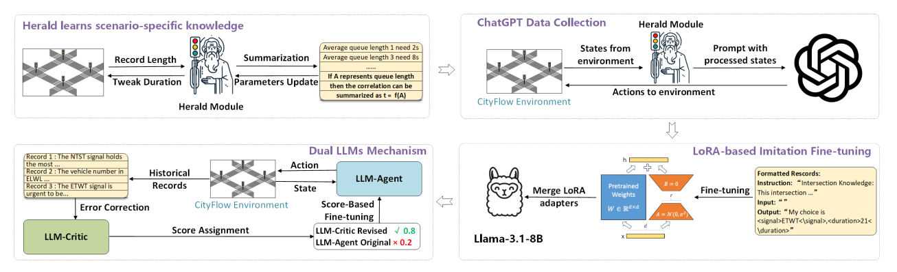

# A Dual Large Language Models Architecture with Herald Guided Prompts for Parallel Fine Grained Traffic Signal Control

<a id="Introduction"></a>

## 1 Introduction

Leveraging large language models (LLMs) in traffic signal control (TSC) improves optimization efficiency and interpretability compared to traditional reinforcement learning (RL) methods. However, existing LLM-based approaches are limited by fixed time signal durations and are prone to hallucination errors, while RL methods lack robustness in signal timing decisions and suffer from poor generalization. To address these challenges, this paper proposes HeraldLight, a dual LLMs architecture enhanced by Herald guided prompts. The Herald Module extracts contextual information and forecasts queue lengths for each traffic phase based on real-time conditions. The first LLM, LLM-Agent, uses these forecasts to make fine grained traffic signal control, while the second LLM, LLM-Critic, refines LLM-Agent’s outputs, correcting errors and hallucinations. These refined outputs are used for score-based fine-tuning to improve accuracy and robustness. Simulation experiments using CityFlow on real world datasets covering 224 intersections in Jinan (12), Hangzhou (16), and New York (196) demonstrate that HeraldLight outperforms state of the art baselines, achieving a 20.03% reduction in average travel time across all scenarios and a 10.74% reduction in average queue length on the Jinan and Hangzhou scenarios.



<a id="requirements"></a>

## 2 Requirements

* `python>=3.9`
* `cityflow`
* `pandas==1.5.0`
* `numpy==1.26.2`
* `wandb==0.16.5`
* `transformers==4.51.3`
* `vllm==0.8.5.post1`

> **Note:** [`CityFlow`] requires a Linux environment. We run on Ubuntu.

<a id="Usage"></a>

## 3 Herald Module Learns from Scenario

The **Herald Module** automatically collects scenario information and summarizes per-phase signals/queues.

```shell
python run_herald_summarize.py -jinan --traffic_files anon_3_4_jinan_real.json --wandb_name demo --memo exp1
```

<a id="Training"></a>

## 4 Run ChatGPT Data Collection

Use the script below to collect data and interact with CityFlow via most OpenAI-compatible LLM APIs.
Modify the internal parameters to switch models or endpoints as needed.

```shell
python run_gpt.py
```

## 5 LoRA-based Imitation Fine-tuning

**Step 1.** Fine-tuning scripts are located in `./finetune/*`.

```shell
python fintune/finetune_new.py
```

**Step 2.** Merge LoRA weights after fine-tuning:

```shell
python fintune/merge_new_lora.py
```

## 6 Dual LLMs Mechanism

**Data format** for score-based fine-tuning:

```json
{
  "query": "Here is prompt",
  "responses": [
    "Answer 1",
    "Answer 2"
  ],
  "scores": [0.8, 0.2]
}
```

Then run **score-based fine-tuning**:

```shell
python fintune/RankTrainer/Trainer.py
```


## HeraldLight Prompt Template
> **Intersection Knowledge:**  
> This intersection operates with a four-signal-phase system. The signal phases are defined as follows:  
> **ETWT (East and West Through):** Permits vehicles to proceed straight in both the East and West directions.  
> **NTST (North and South Through):** Permits vehicles to proceed straight in both the North and South directions.  
> **ELWL (East and West Left-Turn):** Permits vehicles to make left turns in both the East and West directions.  
> **NLSL (North and South Left-Turn):** Permits vehicles to make left turns in both the North and South directions.
> 
> **Task Description:**  
> **Task 1: Signal Phase Selection**  
> You will receive the queueing vehicle data for each of the four signal phases. Your task is to select the most urgent phase based on the following criteria:
> 
> 1. **Total Queue Calculation:**  
>    - **Empty:** Indicates no vehicles are queued for that phase.  
>    - **[num1, num2]:** Represents the number of queued vehicles in two lanes controlled by the phase. For example, ETWT controls one lane in the East and one in the West. Sum \texttt{num1} and \texttt{num2} to obtain the total queue for the phase.  
>    - **[num1]:** Indicates that only one lane has queued vehicles, and the other lane is empty.
> 
> 2. **Phase Comparison:**  
>    - Compare the total queue numbers across all four phases.  
>    - If queue totals are similar between phases, assess the balance of each phase: A large difference between \texttt{num1} and \texttt{num2} signifies an imbalance. An imbalanced phase leads to inefficient use of traffic duration, as the signal allows both lanes to proceed simultaneously, potentially wasting time when one lane has significantly fewer queued vehicles.
> 
> 3. **Two Versions of Queueing Set:**  
>    - **Herald Version:** Calculates future vehicle movements, effectively representing the queueing situation. It is a highly efficient prediction method, and in most cases, it is recommended to use this version for decision-making.  
>    - **Original Version:** Represents the vehicles queueing at the current time step and does not account for vehicles that will be running in the future. Only when the Herald version shows severe imbalance (e.g., the final duration calculated based on Herald Version is too long (\texttt{Duration > 30})) should you analyze if this long duration is reasonable, using the Original version for short-term gains.
> 
> **Task 2: Duration Selection**  
> After selecting the optimal signal phase in Task 1, determine the appropriate traffic duration using the following steps:  
> 1. Identify the larger number between \texttt{num1} and \texttt{num2} in the selected phase and denote it as A.  
> 2. Calculate the initial duration: \texttt{Duration = (A * 3) - 1}.  
> 3. Adjust the duration based on the following rules (if you picked Original version, this step should be skipped):  
>    - If \texttt{Duration > 20}, then \texttt{Duration = Duration - 3}.  
>    - If \texttt{Duration = 14}, then \texttt{Duration = Duration - 2}.
> 
> **Task Details:**  
> The queueing numbers for each phase are provided as follows:  
> - **Herald version:**  
>   ETWT: [4, 1], NTST: [1], ELWL: [1], NLSL: [1, 4]  
> - **Original version:**  
>   ETWT: [2, 1], NTST: [1], ELWL: [1], NLSL: [1, 3]
> 
> **Requirements:**  
> 1. Identify the Optimal Traffic Signal: Analyze the queueing data to select the most urgent phase.  
> 2. Calculate the Duration: Determine the appropriate duration based on the selected phase.  
> 3. Provide the Final Decision: Present the chosen signal phase and duration.  
> **Selection Constraints:**  
> - Only one signal phase can be selected.  
> - The final answer must be formatted precisely as:  
>   ```
>   <signal>YOUR_CHOICE</signal>, <duration>YOUR_CHOICE</duration>
> - **Example:**  
>   ```
>   <signal>ETWT</signal>, <duration>5</duration>
>   ```  
> - If all signal phases are empty, select any signal phase with a default duration of 5 to keep the intersection operational.  
> - Ensure the duration is within the range of **0 to 40**. Durations outside this range are considered invalid.  
> - Each tag (<signal> and <duration>) should appear only once in the final answer.
> 
> **Important:**  
> **You MUST provide the answer in the specified format:**  
> ```
> <signal>YOUR_CHOICE</signal>,<duration>YOUR_CHOICE</duration>
> ```
> Any other format will not be accepted.
